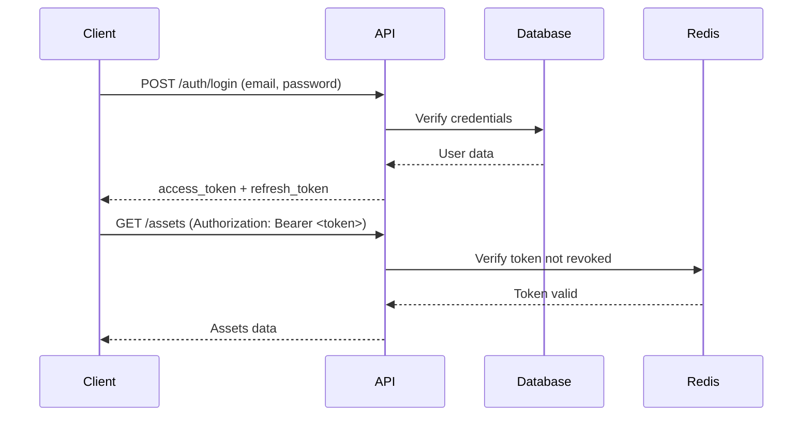

# EASM Platform REST API Documentation

## Sprint 3 - Complete FastAPI Implementation

**Version:** 3.0.0
**Base URL:** `http://localhost:8000`
**API Prefix:** `/api/v1`
**Documentation:** `http://localhost:8000/api/docs`

---

## Table of Contents

1. [Overview](#overview)
2. [Authentication](#authentication)
3. [API Endpoints](#api-endpoints)
4. [Request/Response Examples](#examples)
5. [Error Handling](#error-handling)
6. [Rate Limiting](#rate-limiting)
7. [Multi-tenancy](#multi-tenancy)

---

## Overview

The EASM Platform API provides comprehensive RESTful endpoints for managing external attack surface assets, vulnerabilities, and continuous reconnaissance operations.

### Features

- **JWT Authentication** with access and refresh tokens (HS256/RS256)
- **Multi-tenant isolation** with role-based access control (RBAC)
- **Rate limiting** (100 req/min per IP, configurable per user)
- **Comprehensive filtering** and pagination
- **OpenAPI/Swagger** auto-generated documentation
- **Delta queries** for tracking changes over time

### Architecture

```
Authentication → Tenant Selection → Resource Access
     ↓                ↓                    ↓
  JWT Token    Membership Check    RBAC Permission
```

---

## Authentication

### Authentication Flow



### Endpoints

#### 1. Login

**POST** `/api/v1/auth/login`

Authenticate and receive JWT tokens.

**Request:**
```json
{
  "email": "user@example.com",
  "password": "SecurePassword123"
}
```

**Response (200):**
```json
{
  "access_token": "eyJhbGciOiJIUzI1NiIsInR5cCI6IkpXVCJ9...",
  "refresh_token": "eyJhbGciOiJIUzI1NiIsInR5cCI6IkpXVCJ9...",
  "token_type": "bearer",
  "expires_in": 1800,
  "user": {
    "id": 1,
    "email": "user@example.com",
    "username": "user",
    "full_name": "John Doe",
    "is_active": true,
    "is_superuser": false,
    "created_at": "2025-10-20T10:00:00Z",
    "last_login": "2025-10-25T14:30:00Z"
  }
}
```

**Errors:**
- `401 Unauthorized` - Invalid credentials
- `403 Forbidden` - Account inactive

---

#### 2. Refresh Token

**POST** `/api/v1/auth/refresh`

Rotate tokens using refresh token.

**Request:**
```json
{
  "refresh_token": "eyJhbGciOiJIUzI1NiIsInR5cCI6IkpXVCJ9..."
}
```

**Response (200):**
```json
{
  "access_token": "eyJhbGciOiJIUzI1NiIsInR5cCI6IkpXVCJ9...",
  "refresh_token": "eyJhbGciOiJIUzI1NiIsInR5cCI6IkpXVCJ9...",
  "token_type": "bearer",
  "expires_in": 1800
}
```

---

#### 3. Get Current User

**GET** `/api/v1/auth/me`

Get authenticated user profile.

**Headers:**
```
Authorization: Bearer <access_token>
```

**Response (200):**
```json
{
  "id": 1,
  "email": "user@example.com",
  "username": "user",
  "full_name": "John Doe",
  "is_active": true,
  "is_superuser": false,
  "created_at": "2025-10-20T10:00:00Z",
  "last_login": "2025-10-25T14:30:00Z"
}
```

---

#### 4. Logout

**POST** `/api/v1/auth/logout`

Revoke tokens (client should also discard locally).

**Headers:**
```
Authorization: Bearer <access_token>
```

**Response (200):**
```json
{
  "success": true,
  "message": "Logged out successfully"
}
```

---

## Tenant Endpoints

### 1. List Tenants

**GET** `/api/v1/tenants`

List all tenants accessible to current user.

**Headers:**
```
Authorization: Bearer <access_token>
```

**Response (200):**
```json
[
  {
    "id": 1,
    "name": "ACME Corp",
    "slug": "acme-corp",
    "contact_policy": "security@acme.com",
    "created_at": "2025-10-20T10:00:00Z",
    "updated_at": "2025-10-25T14:30:00Z"
  }
]
```

---

### 2. Create Tenant (Admin Only)

**POST** `/api/v1/tenants`

Create new tenant.

**Headers:**
```
Authorization: Bearer <admin_access_token>
```

**Request:**
```json
{
  "name": "TechCorp Inc",
  "slug": "techcorp",
  "contact_policy": "soc@techcorp.com"
}
```

**Response (201):**
```json
{
  "id": 2,
  "name": "TechCorp Inc",
  "slug": "techcorp",
  "contact_policy": "soc@techcorp.com",
  "created_at": "2025-10-25T15:00:00Z",
  "updated_at": "2025-10-25T15:00:00Z"
}
```

**Errors:**
- `400 Bad Request` - Slug already exists
- `403 Forbidden` - Not admin

---

### 3. Get Tenant Dashboard

**GET** `/api/v1/tenants/{tenant_id}/dashboard`

Get comprehensive dashboard with stats and recent activity.

**Response (200):**
```json
{
  "tenant": {
    "id": 1,
    "name": "ACME Corp",
    "slug": "acme-corp"
  },
  "stats": {
    "total_assets": 1250,
    "assets_by_type": {
      "domain": 50,
      "subdomain": 800,
      "ip": 200,
      "url": 150,
      "service": 50
    },
    "total_services": 3420,
    "total_certificates": 156,
    "total_endpoints": 8934,
    "total_findings": 342,
    "findings_by_severity": {
      "critical": 12,
      "high": 45,
      "medium": 123,
      "low": 98,
      "info": 64
    },
    "open_findings": 280,
    "critical_findings": 12,
    "high_findings": 45,
    "expiring_certificates": 8,
    "average_risk_score": 42.5
  },
  "recent_activity": [
    {
      "id": 12345,
      "type": "new_asset",
      "description": "New asset discovered: api.example.com",
      "timestamp": "2025-10-25T14:30:00Z",
      "metadata": {"asset_id": 567}
    }
  ],
  "trending_assets": [],
  "risk_distribution": {
    "critical": 15,
    "high": 85,
    "medium": 420,
    "low": 730
  }
}
```

---

## Asset Endpoints

### 1. List Assets

**GET** `/api/v1/tenants/{tenant_id}/assets`

List assets with filtering and pagination.

**Query Parameters:**
- `type` - Filter by asset type (domain, subdomain, ip, url, service)
- `changed_since` - ISO 8601 timestamp (e.g., `2025-10-20T00:00:00Z`)
- `risk_score` - Minimum risk score (0-100)
- `page` - Page number (default: 1)
- `page_size` - Items per page (default: 50, max: 1000)
- `search` - Search in identifier field

**Examples:**
```
GET /api/v1/tenants/1/assets?type=subdomain&risk_score=70
GET /api/v1/tenants/1/assets?changed_since=2025-10-20T00:00:00Z
GET /api/v1/tenants/1/assets?search=api.example.com
GET /api/v1/tenants/1/assets?page=2&page_size=100
```

**Response (200):**
```json
{
  "items": [
    {
      "id": 567,
      "tenant_id": 1,
      "type": "subdomain",
      "identifier": "api.example.com",
      "first_seen": "2025-10-20T10:00:00Z",
      "last_seen": "2025-10-25T14:30:00Z",
      "risk_score": 75.5,
      "is_active": true,
      "priority": "high",
      "enrichment_status": "enriched",
      "last_enriched_at": "2025-10-25T12:00:00Z",
      "service_count": 3,
      "finding_count": 5,
      "certificate_count": 1,
      "endpoint_count": 45
    }
  ],
  "total": 1250,
  "page": 1,
  "page_size": 50,
  "pages": 25
}
```

---

### 2. Get Asset Details

**GET** `/api/v1/tenants/{tenant_id}/assets/{asset_id}`

Get detailed asset information with related data.

**Response (200):**
```json
{
  "id": 567,
  "tenant_id": 1,
  "type": "subdomain",
  "identifier": "api.example.com",
  "first_seen": "2025-10-20T10:00:00Z",
  "last_seen": "2025-10-25T14:30:00Z",
  "risk_score": 75.5,
  "is_active": true,
  "services": [
    {
      "id": 1234,
      "port": 443,
      "protocol": "https",
      "product": "nginx",
      "version": "1.21.0",
      "http_status": 200,
      "http_title": "API Gateway",
      "technologies": ["nginx", "Node.js", "Express"],
      "has_tls": true,
      "tls_version": "TLSv1.3"
    }
  ],
  "certificates": [
    {
      "id": 89,
      "subject_cn": "*.example.com",
      "issuer": "Let's Encrypt",
      "not_after": "2025-12-20T00:00:00Z",
      "is_expired": false,
      "days_until_expiry": 56,
      "is_wildcard": true
    }
  ],
  "findings": [
    {
      "id": 456,
      "name": "Exposed Admin Panel",
      "severity": "high",
      "status": "open",
      "first_seen": "2025-10-25T10:00:00Z"
    }
  ],
  "endpoints": [
    {
      "id": 7890,
      "url": "https://api.example.com/v1/users",
      "method": "GET",
      "is_api": true,
      "status_code": 200
    }
  ]
}
```

---

### 3. Create Asset (Manual)

**POST** `/api/v1/tenants/{tenant_id}/assets`

Manually create asset (requires write permission).

**Request:**
```json
{
  "type": "domain",
  "identifier": "newdomain.com",
  "priority": "high"
}
```

**Response (201):**
```json
{
  "id": 568,
  "tenant_id": 1,
  "type": "domain",
  "identifier": "newdomain.com",
  "first_seen": "2025-10-25T15:00:00Z",
  "last_seen": "2025-10-25T15:00:00Z",
  "risk_score": 0.0,
  "is_active": true,
  "priority": "high",
  "enrichment_status": "pending"
}
```

---

### 4. Delete Asset (Soft Delete)

**DELETE** `/api/v1/tenants/{tenant_id}/assets/{asset_id}`

Soft delete asset (sets is_active=false).

**Response (200):**
```json
{
  "success": true,
  "message": "Asset deleted successfully"
}
```

---

## Service Endpoints

### 1. List Services

**GET** `/api/v1/tenants/{tenant_id}/services`

List services with filtering.

**Query Parameters:**
- `port` - Filter by port (e.g., 443, 80)
- `product` - Filter by product (e.g., nginx, Apache)
- `has_tls` - Filter by TLS presence (true/false)
- `page`, `page_size` - Pagination

**Example:**
```
GET /api/v1/tenants/1/services?port=443&has_tls=true
```

**Response (200):**
```json
{
  "items": [
    {
      "id": 1234,
      "asset_id": 567,
      "asset_identifier": "api.example.com",
      "port": 443,
      "protocol": "https",
      "product": "nginx",
      "version": "1.21.0",
      "http_status": 200,
      "http_title": "API Gateway",
      "technologies": ["nginx", "Node.js", "Express"],
      "has_tls": true,
      "tls_version": "TLSv1.3",
      "first_seen": "2025-10-20T10:00:00Z",
      "last_seen": "2025-10-25T14:30:00Z"
    }
  ],
  "total": 3420,
  "page": 1,
  "page_size": 50
}
```

---

### 2. Get Service Details

**GET** `/api/v1/tenants/{tenant_id}/services/{service_id}`

Get detailed service information.

**Response (200):**
```json
{
  "id": 1234,
  "asset_id": 567,
  "asset_identifier": "api.example.com",
  "port": 443,
  "protocol": "https",
  "product": "nginx",
  "version": "1.21.0",
  "http_status": 200,
  "http_title": "API Gateway",
  "web_server": "nginx/1.21.0",
  "technologies": ["nginx", "Node.js", "Express"],
  "http_headers": {
    "Server": "nginx/1.21.0",
    "X-Powered-By": "Express",
    "Strict-Transport-Security": "max-age=31536000"
  },
  "response_time_ms": 145,
  "content_length": 2048,
  "has_tls": true,
  "tls_version": "TLSv1.3",
  "first_seen": "2025-10-20T10:00:00Z",
  "last_seen": "2025-10-25T14:30:00Z"
}
```

---

## Certificate Endpoints

### 1. List Certificates

**GET** `/api/v1/tenants/{tenant_id}/certificates`

List TLS/SSL certificates with filtering.

**Query Parameters:**
- `expiring_in` - Days until expiry (e.g., `30` for certs expiring in 30 days)
- `wildcard` - Filter wildcard certificates (true/false)
- `is_expired` - Filter expired certificates (true/false)
- `page`, `page_size` - Pagination

**Example:**
```
GET /api/v1/tenants/1/certificates?expiring_in=30&wildcard=true
```

**Response (200):**
```json
{
  "items": [
    {
      "id": 89,
      "asset_id": 567,
      "asset_identifier": "api.example.com",
      "subject_cn": "*.example.com",
      "issuer": "Let's Encrypt",
      "serial_number": "03AB4F...",
      "not_before": "2025-09-20T00:00:00Z",
      "not_after": "2025-12-20T00:00:00Z",
      "is_expired": false,
      "days_until_expiry": 56,
      "san_domains": ["*.example.com", "example.com"],
      "signature_algorithm": "SHA256withRSA",
      "public_key_algorithm": "RSA",
      "public_key_bits": 2048,
      "is_self_signed": false,
      "is_wildcard": true,
      "has_weak_signature": false,
      "first_seen": "2025-10-20T10:00:00Z",
      "last_seen": "2025-10-25T14:30:00Z"
    }
  ],
  "total": 156,
  "page": 1,
  "page_size": 50
}
```

---

## Endpoint Discovery

### 1. List Endpoints

**GET** `/api/v1/tenants/{tenant_id}/endpoints`

List discovered web endpoints/APIs.

**Query Parameters:**
- `is_api` - Filter API endpoints (true/false)
- `endpoint_type` - Filter by type (api, form, file, redirect, external, static)
- `method` - Filter by HTTP method (GET, POST, PUT, DELETE)
- `page`, `page_size` - Pagination

**Example:**
```
GET /api/v1/tenants/1/endpoints?is_api=true&method=POST
```

**Response (200):**
```json
{
  "items": [
    {
      "id": 7890,
      "asset_id": 567,
      "asset_identifier": "api.example.com",
      "url": "https://api.example.com/v1/users",
      "path": "/v1/users",
      "method": "POST",
      "status_code": 201,
      "content_type": "application/json",
      "endpoint_type": "api",
      "is_api": true,
      "is_external": false,
      "depth": 2,
      "first_seen": "2025-10-25T10:00:00Z",
      "last_seen": "2025-10-25T14:30:00Z"
    }
  ],
  "total": 8934,
  "page": 1,
  "page_size": 50
}
```

---

## Finding Endpoints

### 1. List Findings

**GET** `/api/v1/tenants/{tenant_id}/findings`

List vulnerability findings with filtering.

**Query Parameters:**
- `severity` - Comma-separated severities (critical,high,medium,low,info)
- `status` - Filter by status (open, suppressed, fixed)
- `template_id` - Filter by Nuclei template ID
- `cve_id` - Filter by CVE ID
- `page`, `page_size` - Pagination

**Examples:**
```
GET /api/v1/tenants/1/findings?severity=critical,high&status=open
GET /api/v1/tenants/1/findings?cve_id=CVE-2024-1234
GET /api/v1/tenants/1/findings?template_id=exposed-panels/admin-login
```

**Response (200):**
```json
{
  "items": [
    {
      "id": 456,
      "asset_id": 567,
      "asset_identifier": "api.example.com",
      "source": "nuclei",
      "template_id": "exposed-panels/admin-login",
      "name": "Exposed Admin Panel",
      "severity": "high",
      "cvss_score": 7.5,
      "cve_id": null,
      "status": "open",
      "matched_at": "https://api.example.com/admin",
      "host": "api.example.com",
      "first_seen": "2025-10-25T10:00:00Z",
      "last_seen": "2025-10-25T14:30:00Z",
      "evidence": {
        "matched_line": "Admin Login",
        "matcher_type": "word",
        "extracted": ["admin", "login"]
      }
    }
  ],
  "total": 342,
  "page": 1,
  "page_size": 50
}
```

---

### 2. Suppress Finding (False Positive)

**POST** `/api/v1/tenants/{tenant_id}/findings/{finding_id}/suppress`

Mark finding as suppressed (false positive).

**Request:**
```json
{
  "reason": "This admin panel is internal only, protected by VPN"
}
```

**Response (200):**
```json
{
  "id": 456,
  "status": "suppressed",
  "updated_at": "2025-10-25T15:00:00Z"
}
```

---

### 3. Update Finding Status

**PATCH** `/api/v1/tenants/{tenant_id}/findings/{finding_id}`

Update finding status.

**Request:**
```json
{
  "status": "fixed"
}
```

**Response (200):**
```json
{
  "id": 456,
  "status": "fixed",
  "updated_at": "2025-10-25T15:00:00Z"
}
```

---

## Error Handling

All errors follow consistent format:

```json
{
  "error": "ErrorClassName",
  "detail": "Human-readable error message",
  "status_code": 400,
  "errors": []
}
```

### Common Status Codes

- `200 OK` - Success
- `201 Created` - Resource created
- `400 Bad Request` - Invalid input
- `401 Unauthorized` - Missing/invalid token
- `403 Forbidden` - Insufficient permissions
- `404 Not Found` - Resource not found
- `422 Unprocessable Entity` - Validation error
- `429 Too Many Requests` - Rate limit exceeded
- `500 Internal Server Error` - Server error

### Validation Errors (422)

```json
{
  "error": "ValidationError",
  "detail": "Request validation failed",
  "status_code": 422,
  "errors": [
    {
      "loc": ["body", "email"],
      "msg": "value is not a valid email address",
      "type": "value_error.email"
    }
  ]
}
```

---

## Rate Limiting

Default limits:
- **Unauthenticated:** 60 requests/minute
- **Authenticated:** 100 requests/minute
- **Admin:** 200 requests/minute

Rate limit headers:
```
X-RateLimit-Limit: 100
X-RateLimit-Remaining: 95
X-RateLimit-Reset: 1635174000
```

Rate limit exceeded response (429):
```json
{
  "error": "RateLimitExceeded",
  "detail": "Too many requests. Please try again later.",
  "status_code": 429
}
```

---

## Multi-tenancy

### Tenant Isolation

All resource endpoints are scoped to tenants via path: `/api/v1/tenants/{tenant_id}/...`

### Access Control

Users can only access tenants they belong to, except:
- **Superusers** have access to all tenants
- Tenant access verified via `TenantMembership` table

### Roles

- **viewer** - Read-only access
- **member** - Read + Write access
- **admin** - Full access including member management

### Permission Matrix

| Endpoint | Viewer | Member | Admin |
|----------|--------|--------|-------|
| GET assets | ✓ | ✓ | ✓ |
| POST assets | ✗ | ✓ | ✓ |
| DELETE assets | ✗ | ✗ | ✓ |
| Update tenant | ✗ | ✗ | ✓ |

---

## Development Setup

### 1. Install Dependencies

```bash
pip install -r requirements.txt
```

### 2. Configure Environment

Create `.env` file:
```bash
# Database
POSTGRES_HOST=localhost
POSTGRES_PORT=15432
POSTGRES_DB=easm
POSTGRES_USER=easm
POSTGRES_PASSWORD=easm_dev_password

# Redis
REDIS_HOST=localhost
REDIS_PORT=16379

# JWT
JWT_SECRET_KEY=$(python -c "import secrets; print(secrets.token_urlsafe(64))")
JWT_ALGORITHM=HS256

# CORS
CORS_ORIGINS=["http://localhost:3000","http://localhost:5173"]

# Environment
ENVIRONMENT=development
DEBUG=true
```

### 3. Run Migrations

```bash
alembic upgrade head
```

### 4. Create Admin User

```bash
python scripts/create_admin.py
```

### 5. Start API Server

```bash
# Development (auto-reload)
uvicorn app.main:app --reload --host 0.0.0.0 --port 8000

# Production
uvicorn app.main:app --workers 4 --host 0.0.0.0 --port 8000
```

### 6. Access Documentation

Open browser: `http://localhost:8000/api/docs`

---

## Testing

### Using cURL

```bash
# Login
curl -X POST http://localhost:8000/api/v1/auth/login \
  -H "Content-Type: application/json" \
  -d '{"email":"admin@example.com","password":"admin123"}'

# Get assets
curl -X GET http://localhost:8000/api/v1/tenants/1/assets \
  -H "Authorization: Bearer <access_token>"

# Create asset
curl -X POST http://localhost:8000/api/v1/tenants/1/assets \
  -H "Authorization: Bearer <access_token>" \
  -H "Content-Type: application/json" \
  -d '{"type":"domain","identifier":"example.com"}'
```

### Using Python

```python
import requests

# Login
response = requests.post(
    "http://localhost:8000/api/v1/auth/login",
    json={"email": "admin@example.com", "password": "admin123"}
)
tokens = response.json()

# Get assets
headers = {"Authorization": f"Bearer {tokens['access_token']}"}
response = requests.get(
    "http://localhost:8000/api/v1/tenants/1/assets",
    headers=headers
)
assets = response.json()
print(f"Total assets: {assets['total']}")
```

---

## Production Deployment

### Security Checklist

- [ ] Set strong `JWT_SECRET_KEY` (min 64 chars)
- [ ] Use `RS256` algorithm with key rotation
- [ ] Set `ENVIRONMENT=production`
- [ ] Configure `CORS_ORIGINS` to specific domains
- [ ] Enable HTTPS/TLS
- [ ] Set strong database passwords
- [ ] Enable Redis authentication
- [ ] Configure rate limiting
- [ ] Enable Sentry error tracking
- [ ] Set up log aggregation
- [ ] Configure backup strategy

### Docker Deployment

```yaml
# docker-compose.yml
services:
  api:
    image: easm-api:latest
    ports:
      - "8000:8000"
    environment:
      - ENVIRONMENT=production
      - JWT_SECRET_KEY=${JWT_SECRET_KEY}
      - DATABASE_URL=${DATABASE_URL}
    depends_on:
      - postgres
      - redis
    restart: always
```

### Kubernetes Deployment

See `k8s/` directory for manifests.

---

## Support

- **Documentation:** http://localhost:8000/api/docs
- **Health Check:** http://localhost:8000/health
- **API Stats:** http://localhost:8000/api/v1/stats

---

## Changelog

### Version 3.0.0 (Sprint 3)
- Complete REST API implementation
- JWT authentication with refresh tokens
- Multi-tenant isolation
- RBAC and permission system
- Rate limiting
- Comprehensive filtering and pagination
- OpenAPI documentation

### Version 2.0.0 (Sprint 2)
- Enrichment pipeline integration
- Certificate monitoring
- Endpoint discovery
- Enhanced asset tracking

### Version 1.0.0 (Sprint 1)
- Initial discovery pipeline
- Database models
- Basic asset tracking
